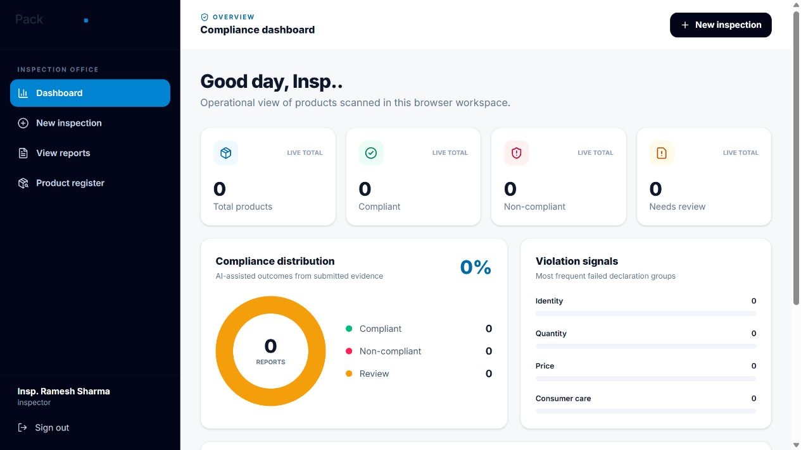
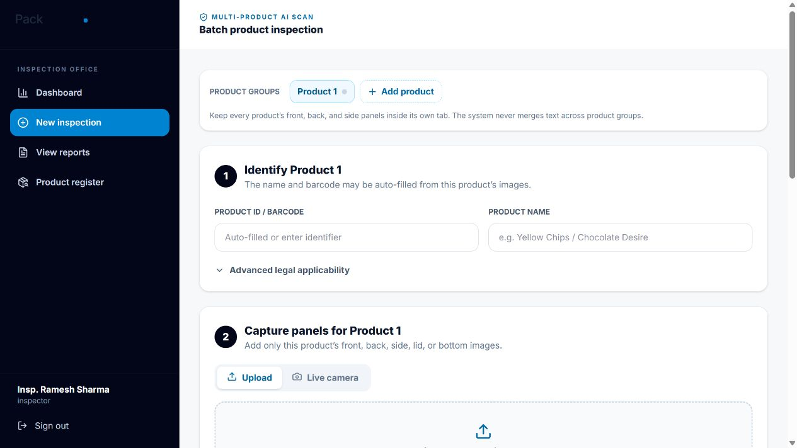

# PackMetrix

PackMetrix is an evidence-first, AI-assisted inspection workspace for packaged commodities. It combines package-image OCR with deterministic Legal Metrology rule checks, role-based access, multi-product evidence grouping, report review, and downloadable PDFs.

> PackMetrix is decision-support software, not a substitute for an authorized inspector or a current legal opinion. A declaration that OCR cannot read is not automatically treated as absent or non-compliant.

## Screenshots

### Compliance dashboard



### Multi-product inspection workflow



## Current capabilities

- Compliance dashboard with total, compliant, non-compliant, and review counts; distribution chart; violation signals; and recent reports.
- Separate product groups for inspecting several products in one session without mixing OCR evidence between products.
- Up to 12 front, back, side, lid, or bottom images per product.
- Upload and live-camera capture modes with a live OCR feed.
- Automatic orientation correction, small-text enhancement, and a dedicated dot-matrix pass for faint MRP, unit-price, batch, manufacture-date, and use-by printing.
- Field-specific mapping for responsible party, address, commodity name, net quantity, MRP, consumer care, FSSAI licence, batch, barcode, origin, dates, and unit sale price.
- Conservative `PASS`, `FAIL`, `REVIEW`, and `NOT_APPLICABLE` outcomes with evidence references.
- Product register, detailed report views, violation lists, OCR transcript, image-quality analysis, compliance score, and PDF export.
- Server-enforced `viewer`, `inspector`, and `admin` roles.
- Versioned Legal Metrology rule registry with date-based rule selection and explicit applicability evaluation.

## Architecture

```text
React 19 + Vite
       |
       | JSON / multipart images / bearer token
       v
FastAPI + SQLAlchemy
       |-- RapidOCR PP-OCRv6 via ONNX Runtime
       |-- deterministic applicability and validation engine
       |-- ReportLab PDF generation
       `-- SQLite locally / PostgreSQL-ready configuration
```

The repository is split into:

- `src/` — React interface, authentication context, dashboard, inspection workflow, reports, and product register.
- `backend/app/` — API, authentication/RBAC, OCR pipeline, declaration mapper, legal rules, validator, persistence models, and PDF reports.
- `backend/tests/` — rule, applicability, OCR-mapping, authentication, RBAC, and report tests.
- `docs/screenshots/` — README screenshots captured from the running local application.

## Run locally

Requirements:

- Node.js 20 or newer
- Python 3.11 or newer

### 1. Start the backend

From the repository root:

```powershell
cd backend
py -m venv .venv
.venv\Scripts\python -m pip install -e ".[dev]"
Copy-Item .env.example .env
.venv\Scripts\python -m uvicorn app.main:app --reload --host 127.0.0.1 --port 8000
```

The backend is available at:

- API: `http://127.0.0.1:8000`
- Health check: `http://127.0.0.1:8000/health`
- Interactive API documentation: `http://127.0.0.1:8000/docs`

### 2. Start the frontend

In a second PowerShell terminal, from the repository root:

```powershell
npm ci
npm run dev -- --host 127.0.0.1
```

Open `http://127.0.0.1:5173`.

Set `VITE_API_URL` if the backend is not running at `http://127.0.0.1:8000`.

## Demo accounts

All local demo accounts use the password `LegalMetrology2026!`.

| Account | Role | Access |
| --- | --- | --- |
| `officer.sharma@consumeraffairs.gov.in` | Inspector | Scan images, run compliance analysis, and view reports |
| `viewer@packmetrix.local` | Viewer | View existing reports and download PDFs |
| `admin@packmetrix.local` | Administrator | Full API role for future administration workflows |

Public signup intentionally creates a viewer account. Inspector and administrator privileges must be assigned server-side.

## OCR and evidence behavior

The OCR pipeline uses several passes because real packaging commonly mixes rotated text, small print, reflective film, and faint dot-matrix stamps:

1. Decode the image and record resolution and blur signals.
2. Detect and correct sideways package panels.
3. Compare normal and enhanced small-text recognition results.
4. Locate the statutory price/date sticker from its printed labels.
5. Re-read faint dot-matrix value rows independently and normalize only field-specific values.
6. Keep the full OCR transcript and bounding boxes as evidence.

Low-confidence, conflicting, or incompletely photographed declarations remain `REVIEW`. Missing evidence becomes `FAIL` only when the inspector confirms complete panel coverage and the submitted images satisfy the quality gate.

## Multi-product inspections

Use **Add product** before uploading images for a different product. Keep every product's front, back, side, lid, and bottom images inside its own tab. PackMetrix runs OCR and validation independently for each product, then produces individual reports and a bulk PDF.

## Image retention

- Local upload and camera frames are kept in memory only long enough to run OCR; raw images are not inserted into the relational database.
- A report retains one compressed 420-pixel JPEG preview in browser storage for this milestone.
- Older previews are removed when browser storage approaches its quota.
- Production deployments should use private object storage with checksums, lifecycle/retention policies, encryption, and access-controlled URLs. The database should retain only metadata and storage references.

## Configuration

Copy `backend/.env.example` to `backend/.env`. Important settings include:

- `PACKMETRIX_DATABASE_URL` — defaults to local SQLite; set a PostgreSQL URL in deployment.
- `PACKMETRIX_CORS_ORIGINS` — allowed frontend origins.
- `PACKMETRIX_AUTH_SECRET` — replace with a long random secret outside local development.

## Verification

```powershell
# Backend
cd backend
.venv\Scripts\python -m pytest -q

# Frontend (from repository root)
npm run lint
npm run build
```

The current checkpoint has 19 passing backend tests. The supplied real-world price sticker was also verified end-to-end for MRP, unit sale price, batch number, manufacture date, and use-by date.

## Current persistence boundary

The relational schema covers inspections, products, image metadata, OCR text, extracted attributes, evidence, rule results, inspector decisions, and audit events. Report history and compressed previews remain in browser storage in this local milestone. Database-backed report persistence, private object storage, deployment hardening, and administrator role-management screens are the next production steps.
